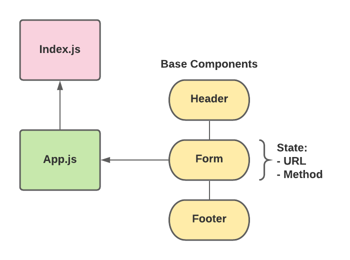

# RESTy

A browser-based, RESTful API testing tool built with React.

## Author: Alex Whan

## Version: 0.9.2

## Overview

**RESTy** is a browser-based, RESTful API testing tool built with React. Users can run the RESTy application in any modern browser, allowing them to quickly and easily interact with APIs and test endpoints in a familiar, intuitive interface.

## Development

Development of RESTy will take place over four distinct phases:

### Phase 1: Application and Setup

- Basic scaffolding of the application, including setting up the React boilerplate code and file structure
- Create a visually appealing site with a Header, Footer, and a large content area
- Create a form that asks for a URL
- Create buttons that let the user choose from the REST methods (get, post, put, delete)
- When the form is filled out, and the button is clicked, display the URL and the method chosen

### Phase 2: Testing and Deployment

- User enters an API URL, chooses a REST Method and clicks the “Go” button to send a request
- Application fetches data from the URL given, with the method specified
- Application will retrieve data from the API
- Displays the response headers and results separately in “pretty printed” JSON format for readability

### Phase 3: State and Props

### Phase 4: Fit and Finish

### UML Diagram

